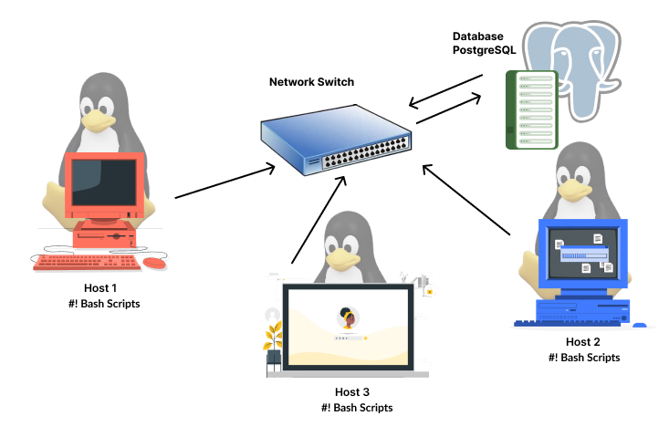

# Linux Cluster Monitoring Agent

 ## Introduction

The scope of the Linux cluster monitoring project is to collect hardware specifications of the machine and automate to store data usage into psql database. This data helps Jarvis Linux Cluster Administrator team (LCA) to monitor the performance of the server, perform data analytics and manage servers. This project can be deployed in any linux host machines for gathering real-time data. The target users for this project is system administrators and IT professionals responsible for managing servers.The technologies used in this project are Git, GitHub, Docker, Bash scripts,  PostgreSQL and Rocky Linux.
 ## Quick Start
### Start a psql instance using psql_docker.sh
If Docker container is not created, create the container by executing
```bash
  ./scripts/psql_docker.sh create [database_name] [database_password]. 
   ```
Once the container is created, run it by command ```./scripts/psql_docker.sh start``` which will start the container and connect to database.

### Create tables using ddl.sql

Once the database is created, execute the file ```ddl.sql``` to create the tables. Two tables are created with names ```host_info``` and ```host_usage``` 
````bash
psql -h localhost -U postgres -d [database_name] -f sql/ddl.sql
````
### Insert hardware specs data into the DB using host_info.sh
Run the file ```host_info.sh``` to gather the hardware specifications of the host machine and store it in ```host_info``` table
````bash
./host_info.sh localhost 5432 [database_name] postgres [database_password]
````
### Insert hardware usage data into the DB using host_usage.sh
Run the file ```host_usage.sh``` to gather the real-time hardware usage data of the host machine and store inside ```host_usage``` table
````bash
./host_usage.sh localhost 5432 [database_name] postgres [database_password]
````
### Crontab setup
Run the command ```crontab -e``` to open cron editor.
````bash 
* * * * * bash /home/rocky/dev/jarvis_data_eng_UmaraniKumaresan/linux_sql/scripts/host_usage.sh localhost 5432 host_agentpostgres rocky1234 > /tmp/host_usage.log
````
## Implementation
### Docker Setup:
Download Docker and write bash script to create, start and stop docker container with PSQL image.
### GitHub Repository:
Create three branches such as ```feature/psql_docker, develop and master``` branches following gitflow branching strategies and setup SSH.
### Database Creation:
A database named ```host_agent``` is created for this project. Two tables named ```host_info``` to store machine specifications and ```host_usage``` to store CPU usages are created.
### Bash Scripts:
The bash scripts ```host_info.sh``` inserts CPU specifications in ```host info``` table and ```host_usage.sh``` inserts CPU usages into ```host_usage table```. The scripts gather data from host machine and insert data into database interacting with psql instance running inside the Docker container.
### Crontab Automation:
Crontab script runs every minute and inserts usage data into ```host_usage``` table.
## Architecture


## Database Modeling
### host_info table schema

| **Column Name**  | **Data type** | **Constraints**       |
|------------------|---------------|-----------------------|
| ID               | SERIAL        | NOT NULL, PRIMARY KEY |
| HOSTNAME         | VARCHAR       | NOT NULL, UNIQUE      |
| CPU_NUMBER       | INT2          | NOT NULL              |
| CPU_ARCHITECTURE | VARCHAR       | NOT NULL              |
| CPU_MODEL        | VARCHAR       | NOT NULL              |
| CPU_MHZ          | FLOAT8        | NOT NULL              |
| L2_CACHE         | INT4          | NOT NULL              |
| TIMESTAMP        | TIMESTAMP     | NULL                  |
| TOTAL_MEM        | INT4          | NULL                  |

### host_usage table schema

| **Column Name** | **Data Type** | **Constraints**                                  |
|-----------------|---------------|--------------------------------------------------|
| TIMESTAMP       | TIMESTAMP     | NOT NULL                                         |
| HOST_ID         | SERIAL        | NOT NULL, FOREIGN KEY (REFERENCES HOST_INFO(ID)) |
| MEMORY_FREE     | INT4          | NOT NULL                                         |
| CPU_IDLE        | INT2          | NOT NULL                                         |
| CPU_KERNEL      | INT2          | NOT NULL                                         |
| DISK_IO         | INT4          | NOT NULL                                         |
| DISK_AVAILABLE  | INT4          | NOT NULL                                         |


## Test
The testing of the scripts was done manually by starting, stopping ```./psql_docker.sh```. I wrote query in the terminal and verified machine configurations are captured and inserted in ```host_info``` table. I also checked ```host_usage``` table and ```crontab -l``` if inserting machine usage information is inserted every minute automatically using crontab.  

## Deployment
The application was deployed via GitHub repository and is hosted in a Docker container. A Docker volume is utilized for persistent data storage, and crontab is used to automate data collection tasks.
## Improvements
 - Create dashboard for IT Operations with key metrics
 - Generate alarm and threshold notifications if critical operating levels are breached


